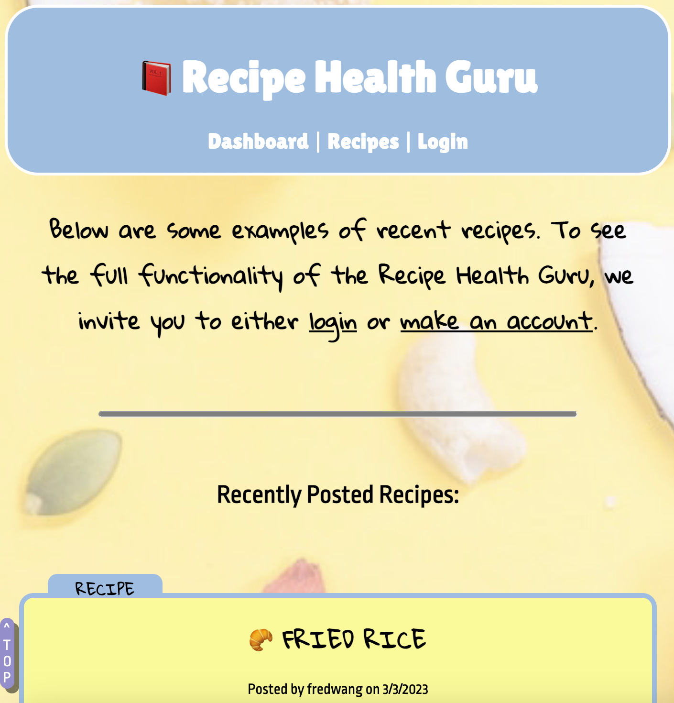
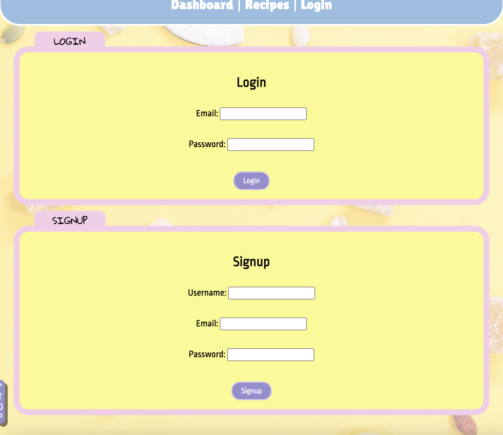
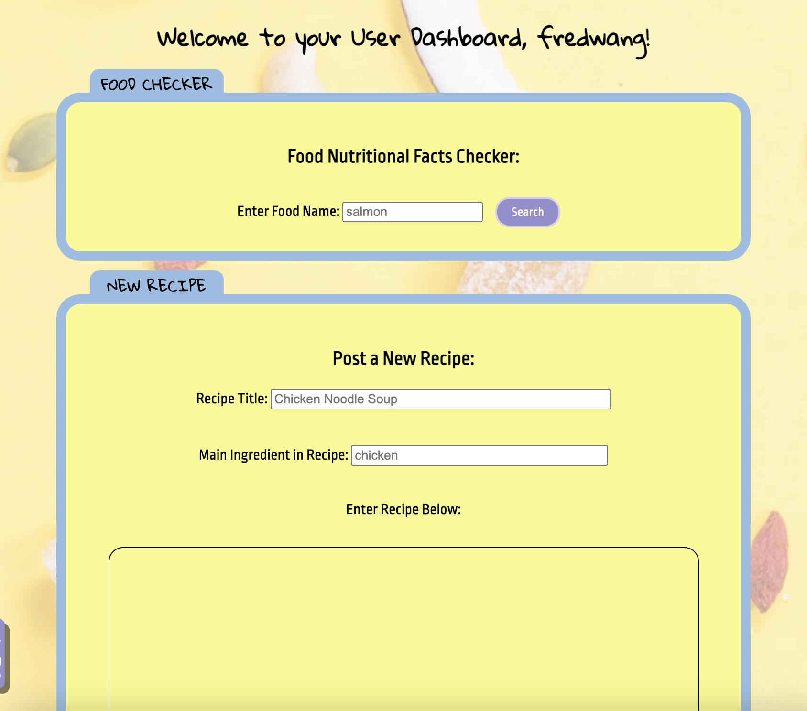
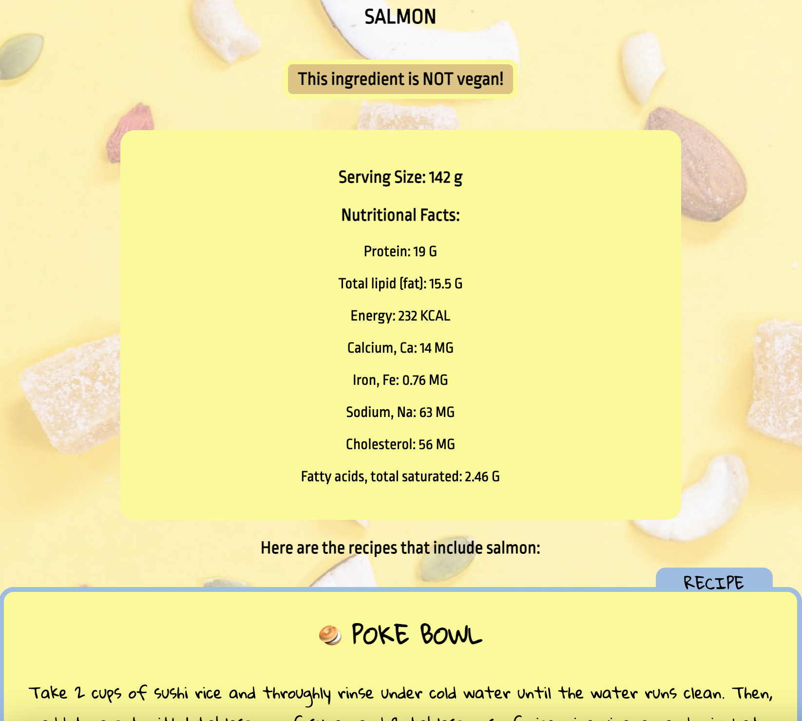
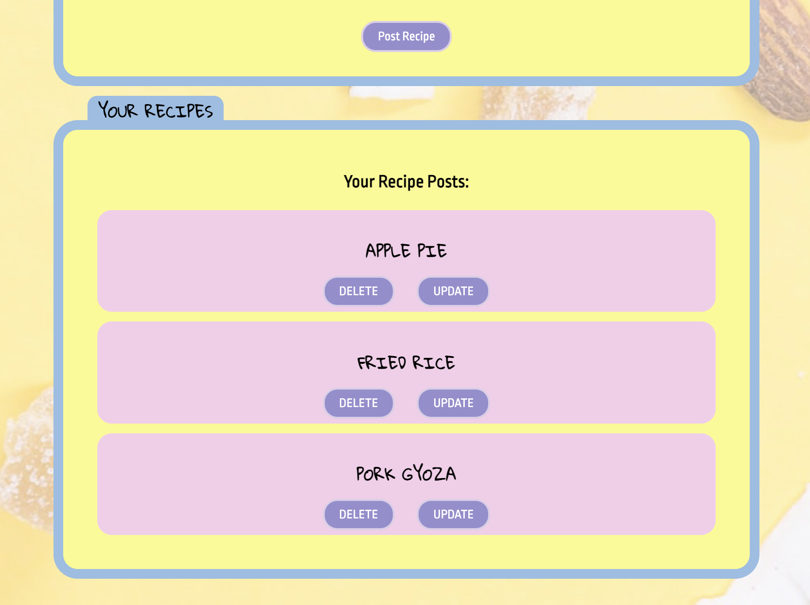
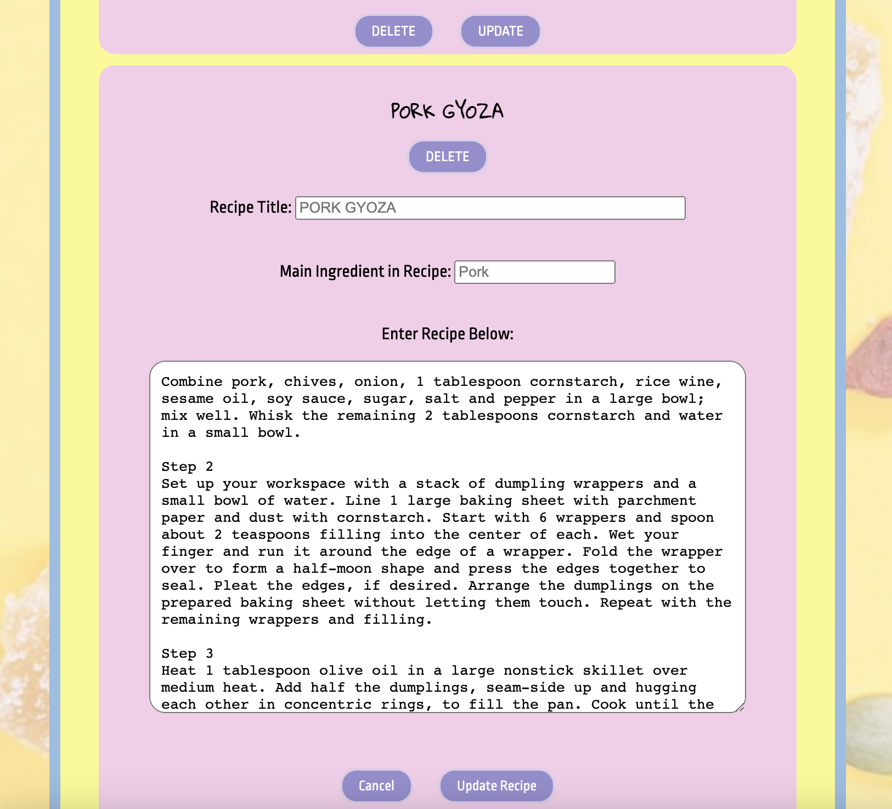
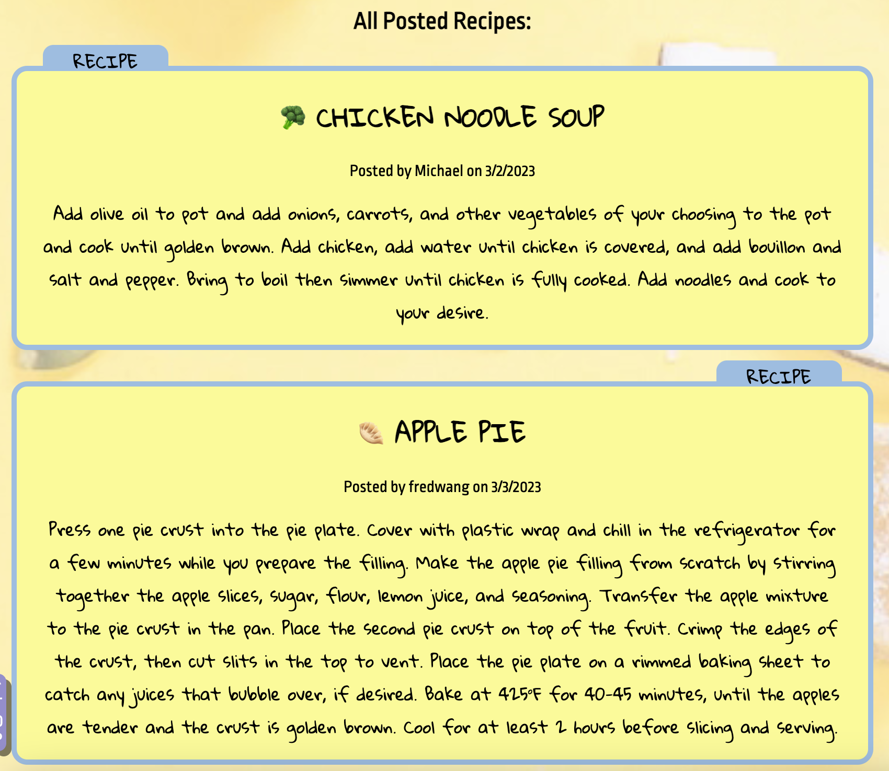
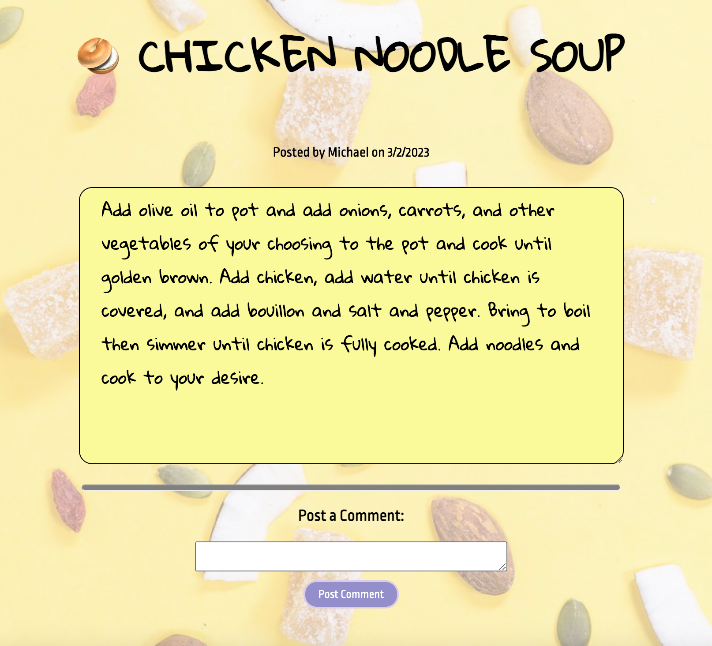
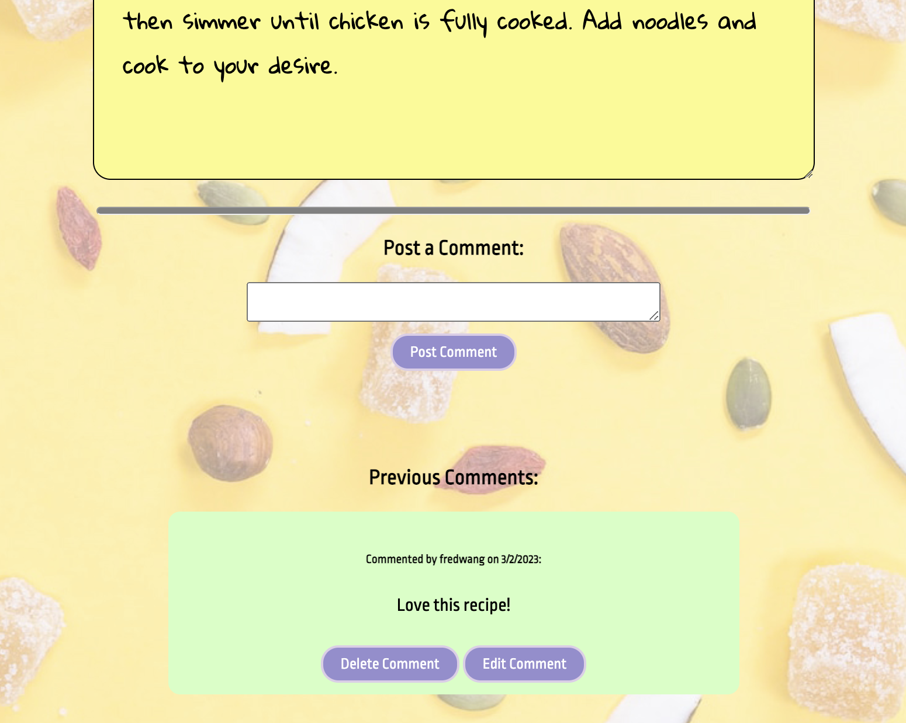

# Recipe Health Guru

## Description

Recipe Health Guru is a social network for foodies where users can look for multiple recipes taking into account the ingredients they have at home, being displayed with the nutritional facts for each ingredient. Users can also comment and add ratings/reviews to other recipes and follow other user's accounts. In order to post or interact with the website the user will have to log in (withAuth) to have full access to the functions.

This App also uses the is-vegan package to inform users if the food ingredient they search for is vegan, as well as the node-fetch library so the API fetch request from the users' food ingredient searches takes place on the backend. The FDC API guide can be found at: https://fdc.nal.usda.gov/api-guide.html

This App is responsive and can be browsed smoothly on both large and small viewports.

The URL of the deployed App is: https://recipe-health-guru.herokuapp.com/

The URL of the repo on GitHub is: https://github.com/jonytoast/health_bar

## Table of Contents
- [Description](#Description)
- [Installation](#Installation)
- [Usage](#Usage)
- [License](#License)
- [Contribution](#Contributing)
- [Credits](#Credits)
- [Questions](#Questions)

## Installation

To run this App locally, run the following command on your terminal: npm start

## Usage

Without signing up or loggin in, users can only browse recipes by clicking on the recipe title on homepage and the recipe page, but will not be allowed to comment on the recipes or post their own recipes. Only when a user is signed up or logged in can he read,post,and comment on other users' recipes. 

Authorized users can navigate to the dashboard,where they can search the FDC's API and the is-vegan library for food ingredient nutritional facts and whether or not the ingredient is vegan, as well as the recipes in the App's database which include the searched ingredient. If the FDC's API returns no food data, they will be alerted accordingly. If the is-vegan library fails to determine if a searched ingredient is vegan, the resulting nutritional fact chart will not come with the "is/is not vegan" warning sign.

Once an authorized user has posted a new recipe, that recipe will appear at the bottom of the dashboard and will display with the update and delete button. When the update button is clicked, a form section will appear below for the user to edit the recipe (or to cancel the edit by clicking on the cancel button). Once the user is finished with editing the recipe, he can click on the update recipe button, and the recipe will save. 

When an authorized user comments on a recipe, he can go back and edit or delete his own comment by clicing on the edit comment and delete comment buttons. 

Here are some screenshots of the App's major functions:

Homepage screenshot:
  

Login Page screenshot:
  

Dashboard screenshot:
  

Nutritional Fact Page screenshot:
  

Previous Recipe Section screenshot:
  

Edit Recipe Function screenshot:
  

All Listed Recipes Page screenshot:
  

Single Recipe Page screenshot:
  

Comment Section screenshot:
  

## License
This application is licensed under the MIT License. 

## Contributing
Feel free to contribute to better improve this application. 
Fork the repository to your GitHub account. Clone the forked repository to your local machine. Create a new branch for your changes and push them to your forked repository. Then submit a pull request to the original repository.

## Credits
This application has been developed by 5 students of the Columbia Engineering Bootcamp: Angela Jaume, Fred Wang, Jony Toast, Michael Shaari and Tony Chavchanidze.

## Questions
If you have any questions about the development of the application or its usage, please open an issue!

